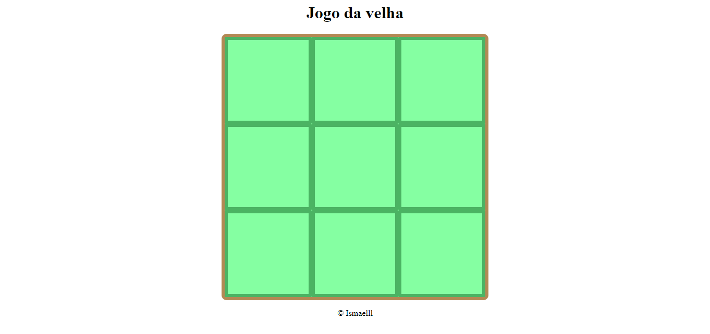

# Jogo_da_velha
>Status: Projeto Completo
;
## Desenvolvimento
Esse projeto imita um jogo da velha simples, com todas as funcionalidades padrões. Nele optei por utilizar principalmente funções, arrays e ForIn, maneira que colaborou e muito para a minha completa compreensão de tais assuntos.  
## Linguagens usadas
+ JavaScript
+ Html
+ Css
## Sobre mim
Me chamo Ismael Mateus de Souza, tenho 18 anos (2021), estou cursando Ciências da Computação. Sou extremamente iniciante na área ainda, mas estou bem empolgado pelo que há de vir.
